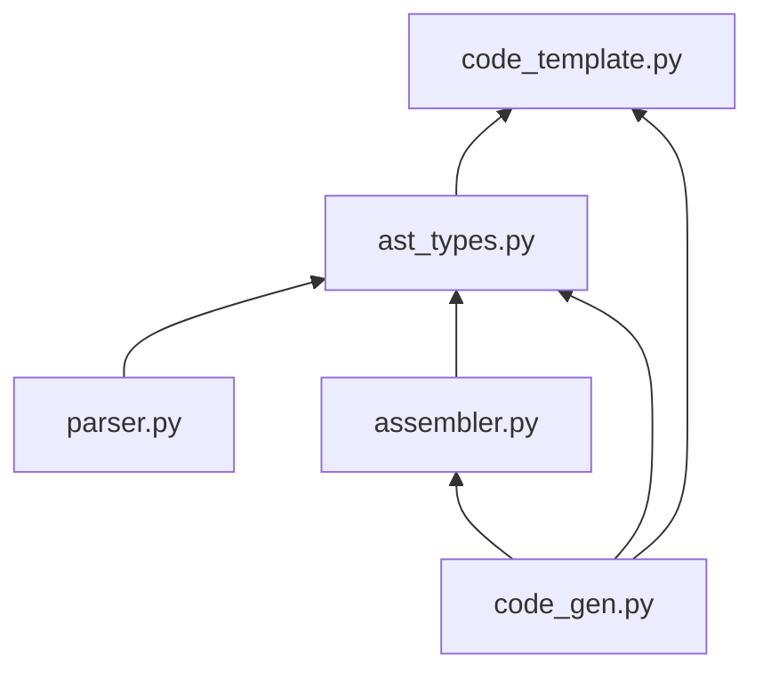
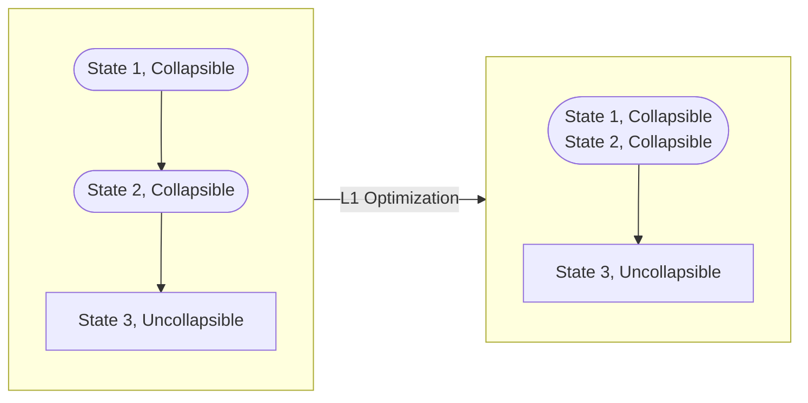
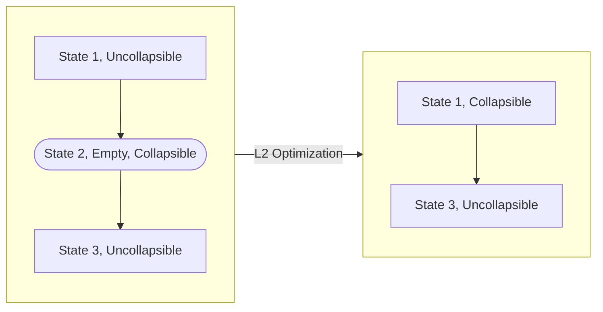
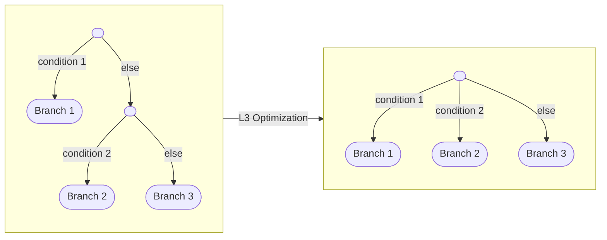
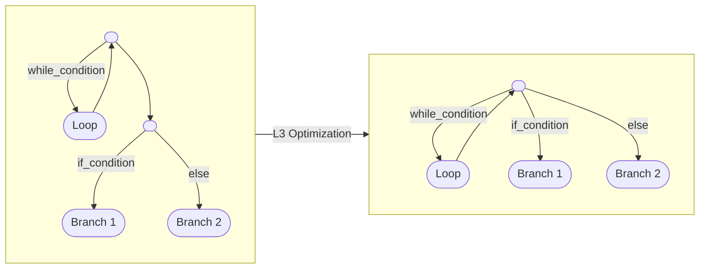
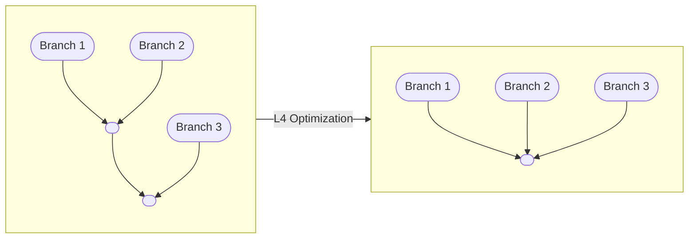
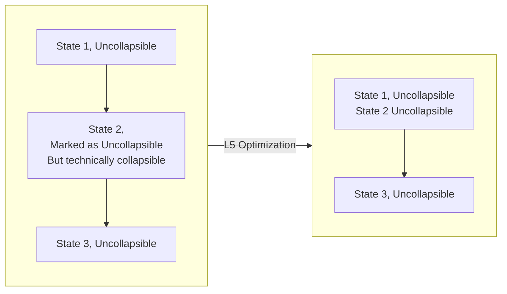
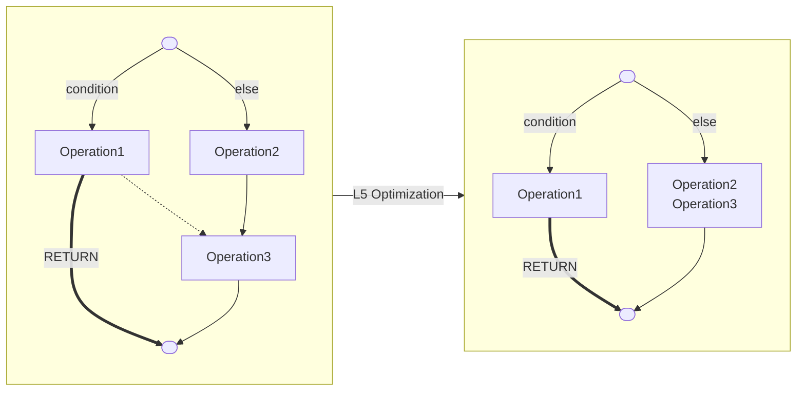
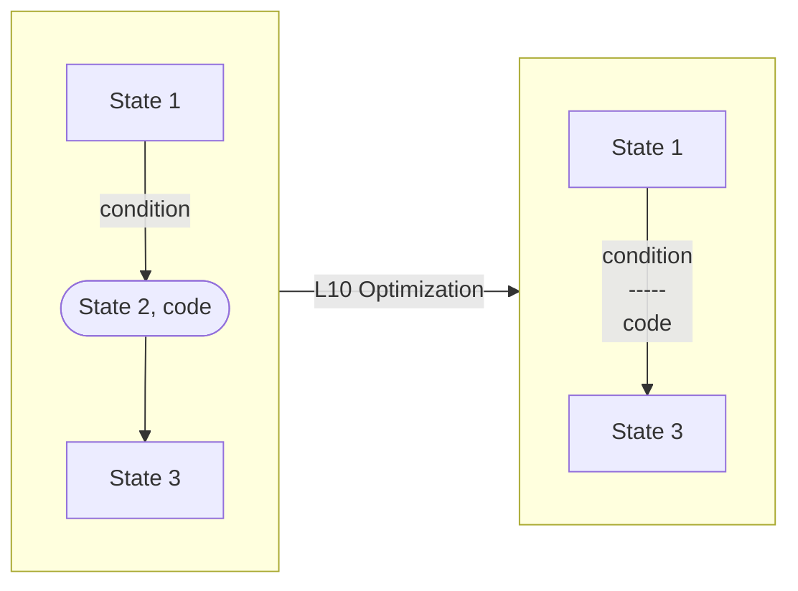

# FSM Compiler

Write the finite state machine as if it's an ordinary function.

## Overview

This project used the Lark module as the basic lexer and parser. The grammar is written in [extended Backus–Naur form (EBNF)](https://en.wikipedia.org/wiki/Extended_Backus–Naur_form).

Two versions of the lark parser:

- basic parser: support basic C/C++ functionalities
- experimental parser: support some advanced C/C++ features

## External Dependency

The project is developed using Python 3.11.x.

External libraries

- [Lark Parser](https://github.com/lark-parser/lark)

## Limitation

- The structural control statement `BREAK`, `CONTINUE`, `RETURN` cannot be in Initialization and Update part of the `FOR` loop

The FSM compiler does not support:

- multiple declarations `int a, b;`
- generics
- `GLOBAL` defined classes
- `for` loop version of infinite loop (`for(;;) { loop; }`)
  - Please use `while(true) { loop; }`  or `do { loop; } while(true);` instead
  - `do { loop; } while(true);` might result in less generated states.
- multiline comment `/* multiline comment */`
  - Please use `//` instead
- lambda functions (anonymous functions)

## FSM Function Syntax

### Structural Control: `BREAK`, `CONTINUE`, and `RETURN`

`BREAK`, `CONTINUE`, and `RETURN` are the same as `break`, `continue` and `return` from C/C++ languages. However, they will modify FSM loops (`FOR`, `WHILE`, and `DO-WHILE`).

When using structural control statement: `BREAK`, `CONTINUE` at the top level of the function, i.e., not in any kind of FSM loops (`FOR`, `WHILE`, and `DO-WHILE`),

- `BREAK` will move the instruction pointer to the end of the function. In this case, `BREAK` is equivalent to `RETURN`.
- `CONTINUE` will move the instruction pointer to the beginning of the function. In other words, this will restart the function in this case.

## Module Structure

- **`parser.py`**: Parse the C/C++ function into an Abstract Syntax Tree (AST). This is the combination of lexer and parser.
- **`assembler.py`**: Convert AST into Finite State Machine. Optimize FSM's. This script contains all FSM-related operations
- **`ast_types.py`**: Contain dataclasses to construct Custom AST and FSM. The custom AST also has methods to generate rudimentary FSM
- **`code_template`**: Contain code snippet to reconstruct C++ statements
- **`code_gen`**: Generate C/C++, Graphvis, and Mermaid codes from FSM

### Dependency



### State Number Assignment and Special State

- Starting state is 0
- Ending state is 1
- Any regular state has a two-digit state number, i.e., `state_number >= 10`

### parser.py

**Important Functions:**

`parse_to_AST(input_str:str) -> ParseResult|None`

- Parse the given code to AST.
- `input_str` is the C/C++ code, and it must start at the FSM function.
- Return `ParseResult` if parse successfully, otherwise, return `None`.
- `ParseResult` is the processed AST; `ParseResult.lark_ast` is the raw AST immediately returned from the lark parser.

## FSM Optimizations

FSM optimization simplifies redundant FSM generated from AST. The optimization algorithm is based on fix-point algorithm, i.e., repetitively applying optimization until the result FSM no longer changes.

### Moore and Mealy Machine Optimization

The raw FSM generated from AST are pure Moore machine because this can simplify the optimization process. Moore machine is FSM whose events or code blocks only depend on the states. Moore machine optimization is enabled by default.

Mealy machine is the FSM that code (or event) that determine by state and transition conditions. Usually Moore machine is more stable because all code block are executed on the clock edge (when tick function is called). Since the input signal and clock signal are not synchronized, Mealy machines might not finish executing code before clock signal changes. However, the output code is sequentially executed by conventional processor (rather than combinational logic), the Mealy machine stability problems occur less frequent, assuming input signal is properly debunked.

Considering Mealy machine is less readable, the Mealy machine optimization should be enabled manually, by setting `optimization_level >= 10`. 

- 5 levels of Moore machine optimizations, single digit level (`level < 10`). Input must be Moore machine.
  - L1, Optimize Consecutive States  
  - L2, Optimize Chained Empty State, and all above
  - L3, Optimize Chained Branching, and all above
  - L4, Optimize Chained Merging, and all above
  - L5, Optimize Consecutive Uncollapsible States, and all above
- 1 level of Mealy machine optimization, two-digit level(`level >= 10`). Mealy machine optimization assume the input is optimized Moore machine.
  - L10, Optimize FSM by Mealy Machine Conversion, and all above

### L1, Optimize Consecutive States  

**This optimization will collapse two collapsible states.**

The correctness is the first priority when FSM is generated from AST. When link multiple FSM states together according to the AST, searching the previous and next states is an error-prone process. Therefore, many empty states are added to simplify the linking process.

Additionally, The FSM generation method preemptively marks potentially uncollapsible states to speed up the optimization.

The optimization process is following:



### L2, Optimize Chained Empty State

**This optimization will by pass empty states.**

When an empty state is sandwiched between two Uncollapsible states, the FSM can bypass the empty state. L1 Optimization cannot resolve this redundancy because it doesn't have check the code block inside the state.

The optimization process is following:



### L3, Optimize Chained Branching

**This optimization will collapse chained if-else branching.**

Chained `IF-ELSE` is a common way to branching out multiple state. The optimizer will identify all Chained `IF-ELSE` behaviors and convert to `switch-liked` behavior, since the `switch-liked` statement doesn't exist in the FSM Compiler grammar.

The optimization process is following:



#### Interesting Node

L3 Optimization can also optimize `WHILE-IF-ELSE` combination:

FSM Code:

```C
WHILE (while_condition) {
    Loop;
}
IF (if_condition2) {
    Branch1;
} ELSE {
    Branch2;
}
```

FSM Generated:



### L4, Optimize Chained Merging

**This optimization will collapse chained if-else merging.**

This one is the counterpart of L3 optimization, i.e. merging multiple branches.

 Multiple merging states could be created by chained branching, or like L3 optimization, this could be resulted from combination between branching and looping.

The optimization process is following:



### L5, Optimize Consecutive Uncollapsible States

**This optimization will analyze the collapsibility among consecutive states and potentially collapse them.**

The structural control statement (`BREAK`, `CONTINUE`, and `RETURN`) will alter the naively labelled uncollapsible state. Even though the resulting FSM is correct, but the altered structure might be further optimized by analyze all incoming and outgoing transition for all states. This process is slow because incoming transition is not tracked and need manually trace back.

The optimization process is following:



#### Example

When optimize following code, the `RETURN` statement will make "Operation3" state potentially collapsible.

```C
FSM example_fsm () {
    IF (condition) {
        Operation1;
        RETURN;
    } ELSE {
        Operation2;
    }
    Operation3;
}
```

The code above will generate following FSM. 



The `RETURN` transition is labelled in bold, and the dotted arrow is the ghosted transition shadowed by `RETURN` transition.

We can collapse "Operation2" and "Operation3" safely because "Operation1" will never follow by "Operation3"

### L10, Optimize FSM by Mealy Machine Conversion

**This optimization convert some state into Mealy machine transition, the resulting FSM will generally have fewer states.**

Mealy machine is the FSM that code (or event) that determine by state and transition conditions. By moving some code blocks into the transitions, the resulting FSM will generally obtain fewer states, and more operations in each state. However, this might not be the desired result, so it is not enabled by default.

The result FSM will be the combination between Moore and Mealy machine. The Mealy conversion will happen if this operation can reduce states.

**This optimization assumes the input FSM is already optimized Moore machine, i.e., the input FSM has already gone through previous optimization.**

**The result mixed Mealy and Moore machine cannot pass into previous optimizations.**

The optimization process is following:



## Roadmap

- [ ] Function call to other FSM
- [ ] C++ templating, i.e. generics
- [x] ~~Structural controls like `break`, `continue`, `return`~~
- [ ] Error state, analogs to ending state
- [x] ~~L6(?) Optimization, convert Moore state to Mealy transition.~~

