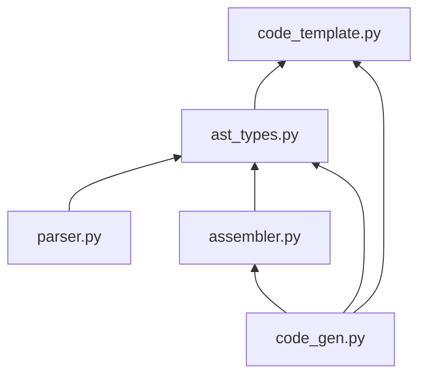

# FSM Compiler

Write the finite state machine as if it's an ordinary function.

## Overview

This project used the Lark module as the basic lexer and parser. The grammar is written in [extended Backus–Naur form (EBNF)](https://en.wikipedia.org/wiki/Extended_Backus–Naur_form).

Two versions of the lark parser:

- basic parser: support basic C/C++ functionalities
- experimental parser: support some advanced C/C++ features

## Limitation

- The structural control statement `BREAK`, `CONTINUE`, `RETURN` cannot be in Initialization and Update part of the `FOR` loop

The FSM compiler does not support:

- multiple declarations `int a, b;`
- generics
- `GLOBAL` defined classes
- `for` loop version of infinite loop (`for(;;) { loop; }`)
  - Please use `while(true) { loop; }`  or `do { loop; } while(true);` instead
  - `do { loop; } while(true);` might result in less generated states.
- multiline comment `/* multiline comment */`
  - Please use `//` instead
- lambda functions (anonymous functions)

## FSM Function Syntax

### Structural Control: `BREAK`, `CONTINUE`, and `RETURN`

`BREAK`, `CONTINUE`, and `RETURN` are the same as `break`, `continue` and `return` from C/C++ languages. However, they will modify FSM loops (`FOR`, `WHILE`, and `DO-WHILE`).

When using structural control statement: `BREAK`, `CONTINUE` at the top level of the function, i.e., not in any kind of FSM loops (`FOR`, `WHILE`, and `DO-WHILE`),

- `BREAK` will move the instruction pointer to the end of the function. In this case, `BREAK` is equivalent to `RETURN`.
- `CONTINUE` will move the instruction pointer to the beginning of the function. In other words, this will restart the function in this case.

## Module Structure

- **`parser.py`**: Parse the C/C++ function into an Abstract Syntax Tree (AST). This is the combination of lexer and parser.
- **`assembler.py`**: Convert AST into Finite State Machine. Optimize FSM's. This script contains all FSM-related operations
- **`ast_types.py`**: Contain dataclasses to construct Custom AST and FSM. The custom AST also has methods to generate rudimentary FSM
- **`code_template`**: Contain code snippet to reconstruct C++ statements
- **`code_gen`**: Generate C/C++, Graphvis, and Mermaid codes from FSM

### Dependency

### State Number Assignment and Special State

- Starting state is 0
- Ending state is 1
- Any regular state has a two-digit state number, i.e., `state_number >= 10`

### parser.py

**Important Functions:**

`parse_to_AST(input_str:str) -> ParseResult|None`

- Parse the given code to AST.
- `input_str` is the C/C++ code, and it must start at the FSM function.
- Return `ParseResult` if parse successfully, otherwise, return `None`.
- `ParseResult` is the processed AST; `ParseResult.lark_ast` is the raw AST immediately returned from the lark parser.

## Roadmap

- [ ] Function call to other FSM
- [ ] C++ templating
- [x] ~~Structural controls like `break`, `continue`, `return`~~
